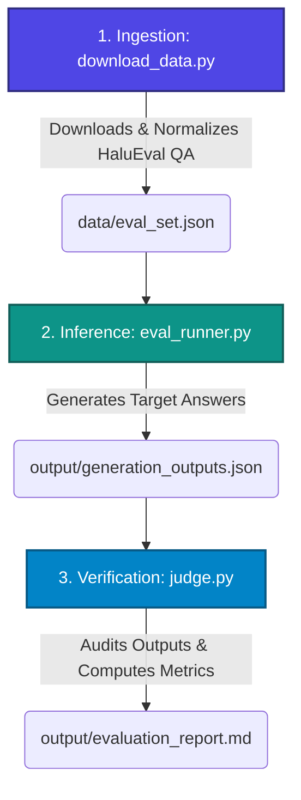

# Phase 1: Automated Hallucination Evaluation

Welcome to the **Evaluation Pipeline** for Project Veracity. This folder implements Phase 1 of the architecture, focusing on shifting from subjective "vibe-checking" of Large Language Model (LLM) outputs to objective, reproducible, and statistically validated metrics.

The pipeline downloads a benchmark dataset, performs batch inference on a target LLM, audits the generations using a larger LLM-as-a-Judge under strict schema constraints, and validates the entire grading system via a meta-evaluation correlation check.

---

## Pipeline Workflow

The automated evaluation pipeline is executed in three sequential steps:



---

## Directory Structure

```text
1.Evaluation/
├── data/
│   ├── eval_set.json              # Streamed, parsed, and normalized HaluEval QA subset (50 samples)
│   └── perturbed_eval_set.json    # Perturbed evaluation set (20 samples) for OOD / contamination tests
├── output/
│   ├── generation_outputs.json    # Target model responses for standard dataset
│   ├── generation_outputs_perturbed.json # Target model responses for perturbed dataset
│   ├── evaluation_report.json      # Standard audit metrics and verdicts database
│   ├── evaluation_report.md        # Standard professional Markdown summary and detailed audit logs
│   ├── evaluation_report_perturbed.json   # Perturbed audit metrics and verdicts database
│   └── evaluation_report_perturbed.md     # Perturbed professional Markdown summary and detailed audit logs
│
├── download_data.py                # Ingestion: Downloads, filters, and standardizes raw dataset
├── eval_runner.py                  # Inference: Runs batch queries on standard dataset via NVIDIA API
├── eval_runner_perturbed.py        # Inference: Runs batch queries on perturbed dataset via NVIDIA API
├── judge.py                        # Audit: LLM-as-a-Judge for standard dataset
├── judge_perturbed.py              # Audit: LLM-as-a-Judge for perturbed dataset with special OOD prompts
└── spot_review.py                  # Utility: Formats contradiction/neutrality records for manual verification
```

---

## Component Details

### 1. Ingestion ([download_data.py](file:///c:/Users/yahya/Desktop/Hallucination/1.Evaluation/download_data.py))
* **Objective**: Fetch and prepare evaluation samples.
* **Mechanism**:
  * Streams and parses the HaluEval QA benchmark from the official GitHub raw repository endpoints.
  * Normalizes the dataset schema on-the-fly, retaining standard keys: `id`, `knowledge`, `question`, `right_answer`, and `hallucinated_answer`.
  * Limits ingestion to the first **50 samples** to optimize iteration speed and control API costs.
  * **Resilience**: Features fallback loops to attempt a secondary remote URL, then checks for local JSON sources (`data/qa_full.json` or `data/qa_100.json`) if network connections are down.

### 2. Inference ([eval_runner.py](file:///c:/Users/yahya/Desktop/Hallucination/1.Evaluation/eval_runner.py))
* **Objective**: Generate factual answers under constrained conditions.
* **Model**: `google/gemma-2-2b-it` (run via NVIDIA API at temperature `0.01`).
* **Mechanism**:
  * Prompts the target model with a context-question structure.
  * Employs strict system instructions: *Answer the question using ONLY the provided Context. If the answer cannot be found in the context, say 'I do not know'.*
  * **Resilience**: Implements a robust `generate_with_retry` wrapper with proactive spacing and exponential backoff to handle API rate limits (`429` errors).

### 3. Verification ([judge.py](file:///c:/Users/yahya/Desktop/Hallucination/1.Evaluation/judge.py) & [judge_perturbed.py](file:///c:/Users/yahya/Desktop/Hallucination/1.Evaluation/judge_perturbed.py))
* **Objective**: Audit the target model's generated answers for hallucinations.
* **Model**: `meta/llama-3.1-70b-instruct` (LLM-as-a-Judge).
* **Mechanism**:
  * Compares the `model_generated_answer` against the original `context` and `question` under three NLI relationships: `ENTAILMENT`, `CONTRADICTION`, and `NEUTRALITY`.
  * Defines a strict output structure using Pydantic (`AuditVerdict`) containing `category` and `reasoning`.
  * **Self-Consistency**: Standard judge runs contradiction check 3 times and takes majority vote (at least 2/3) to resolve final classification confidence.
  * **Calibration Baseline**: Automatically audits the known bad baseline (`known_hallucination_baseline`) to verify and log judge grading calibration correctness.
  * **Global Rate-Limiter**: Enforces `NVIDIA_RPM_LIMIT` requests per minute internally.
  * **Fail-Safe Queue**: Tracks infrastructure connections (429, timeouts) separately and retries them at the end of execution.
  * **Resilience**: Configured to use NVIDIA's `guided_json` schema extension to guarantee JSON format alignment. If unsupported, it falls back to standard JSON mode with custom parsing blocks.

---

## Data Schemas

### Evaluation Set (`data/eval_set.json`)
A JSON array containing objects representing normalized HaluEval samples:
```json
{
  "id": 0,
  "knowledge": "The 2008 Summer Olympics ... were held in Beijing, China.",
  "question": "Where were the 2008 Summer Olympics held?",
  "right_answer": "Beijing, China",
  "hallucinated_answer": "London, United Kingdom"
}
```

### Generation Outputs (`output/generation_outputs.json`)
A JSON array containing objects mapping the generated responses and baselines:
```json
{
  "id": 0,
  "context": "The 2008 Summer Olympics ... were held in Beijing, China.",
  "question": "Where were the 2008 Summer Olympics held?",
  "ground_truth": "Beijing, China",
  "known_hallucination_baseline": "London, United Kingdom",
  "model_generated_answer": "Beijing, China"
}
```

### Judge Audit Verdict (Pydantic Schema)
The judge outputs structured JSON satisfying:
```json
{
  "reasoning": "Step-by-step factuality analysis comparing the target claims to the context...",
  "category": "ENTAILMENT"
}
```

---

## Execution Guide

### Prerequisites
Ensure that the parent directory has a configured `.env` file containing:
```env
NVIDIA_API_KEY=your_nvidia_api_key_here
```

### Option A: Standard Evaluation Pipeline

#### Step 1: Download & Ingest Benchmark Data
Fetch the raw datasets and compile the evaluation set:
```bash
py 1.Evaluation/download_data.py
```
*Generates: `1.Evaluation/data/eval_set.json`*

#### Step 2: Run Target Inference
Run batch generation on the target model:
```bash
py 1.Evaluation/eval_runner.py
```
*Generates: `1.Evaluation/output/generation_outputs.json`*

#### Step 3: Run LLM-as-a-Judge Auditing
Grade target outputs and calculate the hallucination rate:
```bash
# Standard run (includes self-consistency & calibration checks)
py 1.Evaluation/judge.py

# Fast debugging run (skips self-consistency & calibration checks)
py 1.Evaluation/judge.py --fast
```
*Generates: `1.Evaluation/output/evaluation_report.json` and `evaluation_report.md`*

#### Step 4: Optional Manual Spot-Checking
View a parsed list of contradiction and neutrality records to verify judge decisions:
```bash
py 1.Evaluation/spot_review.py
```

### Option B: Perturbed Evaluation Pipeline (OOD / Benchmark Leakage Test)

#### Step 1: Run Target Inference on Perturbed Dataset
Run batch generation on the target model:
```bash
py 1.Evaluation/eval_runner_perturbed.py
```
*Generates: `1.Evaluation/output/generation_outputs_perturbed.json`*

#### Step 2: Run LLM-as-a-Judge Auditing on Perturbed Dataset
Grade target outputs with the specialized judge that handles fictional entities and logical negation:
```bash
# Standard run
py 1.Evaluation/judge_perturbed.py

# Fast debugging run
py 1.Evaluation/judge_perturbed.py --fast
```
*Generates: `1.Evaluation/output/evaluation_report_perturbed.json` and `evaluation_report_perturbed.md`*

---

## R&D Resilience Patterns

* **Graceful Fallbacks**: `download_data.py` uses a sequence of primary remote HTTP -> fallback remote HTTP -> local full JSON file -> local 100-sample JSON file to prevent setup blockages.
* **Exponential Backoff**: Rates are heavily limited by API providers; the execution pipeline implements an automatic exponential retry loop on `429` / rate limit error codes.
* **Strict Schema Decoding**: Evaluators are locked to Pydantic objects using guided decoding mechanisms (or JSON format fallbacks) to prevent schema drift and format failures.
