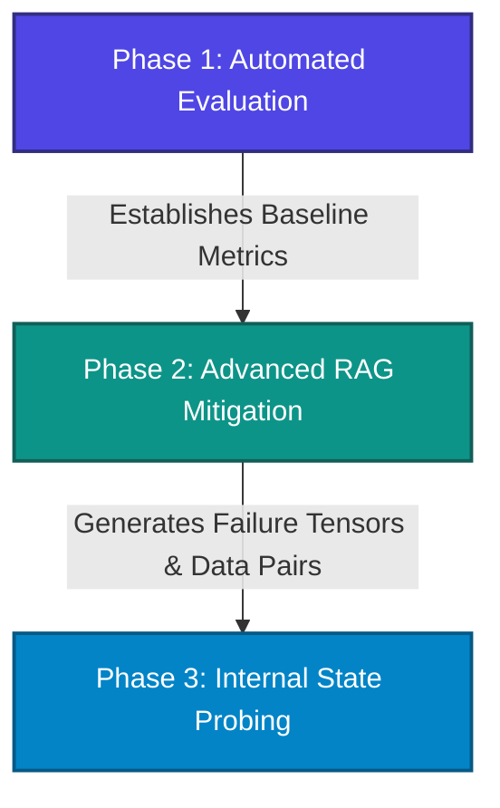

# Project Veracity: LLM Hallucination Evaluation, Mitigation, and Detection

**Project Veracity** is a modular, production-grade framework designed to systematically measure, mitigate, and detect hallucinations in Large Language Models (LLMs). Rather than treating hallucinations as an unpredictable glitch, this framework approaches the problem scientifically across three developmental layers:

1. **Engineering Measurement Problem** (Phase 1 - *Current Baseline Layer*)
2. **Architectural Data Delivery Problem** (Phase 2 - *Mitigation Layer*)
3. **Mechanistic Feature Extraction Problem** (Phase 3 - *Detection Layer*)

---

## Architectural Roadmap

The project is structured linearly to ensure that each stage builds on the findings and data of the previous one.



### Phase 1: Automated Evaluation (Current Phase)

* **Goal**: Shift from subjective "vibe-checking" to reproducible, objective, and statistical metrics.
* **Mechanism**: Runs target model inference on normalized benchmark datasets (e.g., HaluEval) and audits the outputs using an independent, frontier LLM-as-a-Judge with strict schema enforcement.

### Phase 2: Advanced RAG Mitigation (Future)

* **Goal**: Provide non-parametric memory access to ground generations.
* **Mechanism**: Uses query expansion/decomposition, hierarchical parent-child indexing (via LlamaIndex/Qdrant), cross-encoder re-ranking, and self-reflective correction guardrails.

### Phase 3: Internal State Probing (Future)

* **Goal**: Detect if a transformer model internally "knows" it is fabricating claims before token generation finishes.
* **Mechanism**: Hook residual streams (using `TransformerLens`) during forward passes, cache hidden state tensors, and train regularized linear probes (logistic regression) to classify truthfulness.

---

## Repository Structure

The current codebase focuses on the implementation and validation of **Phase 1: Automated Evaluation**.

```text
Hallucination/
│
├── 1.Evaluation/                # Phase 1: Evaluation Pipeline
│   ├── data/                    # Evaluation inputs and raw files
│   │   ├── eval_set.json        # Streaming subset of normalized HaluEval QA (50 samples)
│   │   ├── perturbed_eval_set.json # Perturbed evaluation set for OOD checks
│   │   └── gemini_qa_eval_results.json # Historic evaluation results
│   ├── output/                  # Generated evaluation outputs and reports
│   │   ├── generation_outputs.json # Inference answers from target model
│   │   ├── generation_outputs_perturbed.json # Inference answers for perturbed set
│   │   ├── evaluation_report.json # Detailed metrics JSON
│   │   ├── evaluation_report.md  # Detailed metrics markdown report
│   │   ├── evaluation_report_perturbed.json # Detailed metrics JSON for perturbed set
│   │   └── evaluation_report_perturbed.md  # Detailed metrics markdown for perturbed set
│   │
│   ├── download_data.py         # Stream, parse, and normalize HaluEval QA subset
│   ├── eval_runner.py           # Run batch inference on target model via NVIDIA API
│   ├── eval_runner_perturbed.py # Run batch inference on perturbed dataset via NVIDIA API
│   ├── judge.py                 # LLM-as-a-Judge script with structured JSON schema
│   ├── judge_perturbed.py       # LLM-as-a-Judge script for perturbed dataset
│   └── spot_review.py           # Short spot-review printing script for manual validation
│
├── .env                         # API keys and environment variables (ignored by Git)
├── .gitignore                   # Version control exclusions
├── Doc.md                       # Comprehensive architectural blueprint and design journal
├── pyproject.toml               # Python project configuration and dependencies
└── README.md                    # Project overview and run guide (this file)
```

---

## Component Deep-Dive (Phase 1)

### 1. Ingestion: [download_data.py](file:///c:/Users/yahya/Desktop/Hallucination/1.Evaluation/download_data.py)

* **Purpose**: Downloads and structures evaluation data streamingly.
* **How it works**:
  * Attempts to stream the HaluEval QA dataset from github endpoints (primary and fallback repositories) line-by-line.
  * Streams raw JSON lines, bypassing memory overhead, and parses them on-the-fly.
  * Falls back automatically to local datasets (`qa_full.json` or `qa_100.json`) if network endpoints are blocked or rate-limited.
  * Normalizes the schema into consistent keys (`id`, `knowledge`, `question`, `right_answer`, `hallucinated_answer`).
  * Saves the first **50 entries** to `data/eval_set.json`.

### 2. Inference: [eval_runner.py](file:///c:/Users/yahya/Desktop/Hallucination/1.Evaluation/eval_runner.py)

* **Purpose**: Generates answers from the target evaluation model.
* **How it works**:
  * Loads configurations and uses the OpenAI SDK to interact with the high-performance NVIDIA API hosted endpoints.
  * Uses target model `google/gemma-2-2b-it` under temperature `0.01` to ensure deterministic, reproducible results.
  * Constrains the target model via system instructions to answer *only* using the provided context, or state "I do not know" if context is insufficient.
  * Integrates proactive sleep intervals and an exponential backoff loop to elegantly handle rate limits (`429` errors).
  * Writes structured generation lines containing question, context, ground truth, baseline hallucination, and model answer into `output/generation_outputs.json`.

### 3. Verification: [judge.py](file:///c:/Users/yahya/Desktop/Hallucination/1.Evaluation/judge.py) & [judge_perturbed.py](file:///c:/Users/yahya/Desktop/Hallucination/1.Evaluation/judge_perturbed.py)

* **Purpose**: Implements the LLM-as-a-Judge protocol using a three-way Natural Language Inference (NLI) paradigm.
* **How it works**:
  * Reads target generations and prompts the evaluator model `meta/llama-3.1-70b-instruct` to audit answers against context.
  * Enforces structured JSON payloads conforming to a Pydantic `AuditVerdict` schema (containing `category` and `reasoning`).
  * **Self-Consistency Safeguard**: For any initial `CONTRADICTION` verdict, the judge automatically runs 2 additional times (total of 3). A final contradiction is only recorded if a majority (at least 2 of 3) agree; otherwise, the record is flagged with a `"low_confidence_contradiction"` status to filter out false positives.
  * **Calibration Baseline Check**: For successful `ENTAILMENT` and `CONTRADICTION` evaluations, separately prompts the judge with the `known_hallucination_baseline` to confirm it correctly flags it as a `CONTRADICTION`. Prints the final calibration error percentage.
  * **Robust Rate-Limiting**: Regulates requests across all features using a global token-bucket rate limiter. Reads the self-imposed limit from `NVIDIA_RPM_LIMIT` (default 20).
  * **Infra Failure Reprocessing**: Automatically distinguishes rate limits, connection timeouts, and server errors from real judge failures. Failed calls are queued and re-run at the end of the pipeline with longer backoffs and delays.
  * **Fast Budget Mode**: Supports a `--fast` / `--budget-mode` CLI flag to skip self-consistency and calibration baseline checks during rapid debugging cycles.
  * **Metrics Divergence Warning**: Compares current metrics against the previous report and logs a warning warning if any metric shifted by more than 2 percentage points.

### 4. Spot Review: [spot_review.py](file:///c:/Users/yahya/Desktop/Hallucination/1.Evaluation/spot_review.py)

* **Purpose**: Pulls and formats records for human validation.
* **How it works**:
  * Scans `evaluation_report.json` and `evaluation_report_perturbed.json`.
  * Filters and prints all evaluated records categorized as `CONTRADICTION` or `NEUTRALITY` (and low-confidence contradiction events).
  * Outputs question, context, ground truth, target model answer, and judge reasoning for easy verification.


---

## Getting Started

### Prerequisites

* Python 3.14+ (as configured in `pyproject.toml`)
* [uv](https://github.com/astral-sh/uv) or `pip` for dependency management.

### Installation & Setup

1. **Clone the repository and navigate to its root directory:**

   ```bash
   cd Hallucination
   ```

2. **Install dependencies:**
   Using `uv` (recommended):

   ```bash
   uv sync
   ```

   Or using standard `pip`:

   ```bash
   pip install -e .
   ```

3. **Configure Environment Variables:**
   Create a `.env` file in the project root:

   ```env
   NVIDIA_API_KEY=your_nvidia_api_key_here
   ```

### Running the Evaluation Pipeline

Execute the pipeline sequentially:

1. **Step 1: Download and Prepare the Data**

   ```bash
   python 1.Evaluation/download_data.py
   ```

   This streams and normalizes the raw dataset, outputting `1.Evaluation/data/eval_set.json`.

2. **Step 2: Run Target Model Inference**

   ```bash
   # For standard dataset:
   python 1.Evaluation/eval_runner.py
   
   # For perturbed dataset (OOD / Leakage test):
   python 1.Evaluation/eval_runner_perturbed.py
   ```

   This prompts `google/gemma-2-2b-it` to answer the evaluation questions, outputting results into `1.Evaluation/output/generation_outputs.json` (or `generation_outputs_perturbed.json`).

3. **Step 3: Audit and Score Results**

   ```bash
   # Audit standard dataset:
   python 1.Evaluation/judge.py
   
   # Audit perturbed dataset:
   python 1.Evaluation/judge_perturbed.py
   ```

   *Optional Flags*: Add `--fast` or `--budget-mode` to skip self-consistency checks and baseline calibration loops to speed up runs.
   This runs the `meta/llama-3.1-70b-instruct` model as a judge to assess correctness and calculate all statistics (AR, COV, FR, QAFY, F0.5-Factuality).

4. **Step 4: Manual Spot Check (Optional)**

   ```bash
   python 1.Evaluation/spot_review.py
   ```

   This outputs evaluated records categorized as `CONTRADICTION` or `NEUTRALITY` for quick human verification.

---

## R&D Resilience Patterns

* **Graceful Fallbacks**: The data downloader falls back sequentially (Primary HTTP -> Fallback HTTP -> Local full JSON file -> Local 100-sample JSON file) to avoid setup blockages.
* **Exponential Backoff**: APIs are rate-limited heavily; the pipeline features exponential retry loops specifically catching rate limit exceptions (`429`).
* **Strict Schema Enforcement**: The evaluation judge uses guided decoding to enforce Pydantic output shapes, ensuring zero JSON parsing errors during scoring runs.
