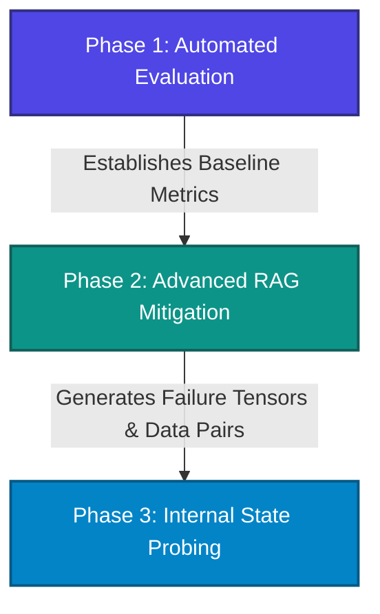

# Project Veracity: LLM Hallucination Evaluation, Mitigation, and Detection

**Project Veracity** is a modular, production-grade framework designed to systematically measure, mitigate, and detect hallucinations in Large Language Models (LLMs). Rather than treating hallucinations as an unpredictable glitch, this framework approaches the problem scientifically across three developmental layers:
1. **Engineering Measurement Problem** (Phase 1 - *Current Baseline Layer*)
2. **Architectural Data Delivery Problem** (Phase 2 - *Mitigation Layer*)
3. **Mechanistic Feature Extraction Problem** (Phase 3 - *Detection Layer*)

---

## Architectural Roadmap

The project is structured linearly to ensure that each stage builds on the findings and data of the previous one.



### Phase 1: Automated Evaluation (Current Phase)
* **Goal**: Shift from subjective "vibe-checking" to reproducible, objective, and statistical metrics.
* **Mechanism**: Runs target model inference on normalized benchmark datasets (e.g., HaluEval) and audits the outputs using an independent, frontier LLM-as-a-Judge with strict schema enforcement.

### Phase 2: Advanced RAG Mitigation (Future)
* **Goal**: Provide non-parametric memory access to ground generations.
* **Mechanism**: Uses query expansion/decomposition, hierarchical parent-child indexing (via LlamaIndex/Qdrant), cross-encoder re-ranking, and self-reflective correction guardrails.

### Phase 3: Internal State Probing (Future)
* **Goal**: Detect if a transformer model internally "knows" it is fabricating claims before token generation finishes.
* **Mechanism**: Hook residual streams (using `TransformerLens`) during forward passes, cache hidden state tensors, and train regularized linear probes (logistic regression) to classify truthfulness.

---

## Repository Structure

The current codebase focuses on the implementation and validation of **Phase 1: Automated Evaluation**.

```text
Hallucination/
│
├── 1.Evaluation/                # Phase 1: Evaluation Pipeline
│   ├── data/                    # Evaluation inputs, intermediates, and outputs
│   │   ├── eval_set.jsonl       # Streaming subset of normalized HaluEval QA (50 samples)
│   │   ├── generation_outputs.jsonl # Inference answers from Llama-3.1-8B-Instruct
│   │   ├── gemini_qa_eval_results.json # Historic evaluation results
│   │   └── [halueval_raw_jsons] # Raw HaluEval datasets (qa, dialogue, summarization, etc.)
│   │
│   ├── download_data.py         # Stream, parse, and normalize HaluEval QA subset
│   ├── eval_runner.py           # Run batch inference on target models via NVIDIA API
│   └── judge.py                 # LLM-as-a-Judge script with structured JSON schema
│
├── .env                         # API keys and environment variables (ignored by Git)
├── .gitignore                   # Version control exclusions
├── Doc.md                       # Comprehensive architectural blueprint and design journal
├── pyproject.toml               # Python project configuration and dependencies
└── README.md                    # Project overview and run guide (this file)
```

---

## Component Deep-Dive (Phase 1)

### 1. Ingestion: [download_data.py](file:///c:/Users/yahya/Desktop/Hallucination/1.Evaluation/download_data.py)
* **Purpose**: Downloads and structures evaluation data streamingly.
* **How it works**:
  * Attempts to stream the HaluEval QA dataset from github endpoints (primary and fallback repositories) line-by-line.
  * Streams raw JSON lines, bypassing memory overhead, and parses them on-the-fly.
  * Falls back automatically to local datasets (`qa_full.json` or `qa_100.json`) if network endpoints are blocked or rate-limited.
  * Normalizes the schema into consistent keys (`id`, `knowledge`, `question`, `right_answer`, `hallucinated_answer`).
  * Saves the first **50 entries** to `data/eval_set.jsonl`.

### 2. Inference: [eval_runner.py](file:///c:/Users/yahya/Desktop/Hallucination/1.Evaluation/eval_runner.py)
* **Purpose**: Generates answers from the target evaluation model.
* **How it works**:
  * Loads configurations and uses the OpenAI SDK to interact with the high-performance NVIDIA API hosted endpoints.
  * Uses target model `meta/llama-3.1-8b-instruct` under temperature `0.0` to ensure deterministic, reproducible results.
  * Constrains the target model via system instructions to answer *only* using the provided context, or state "I do not know" if context is insufficient.
  * Integrates proactive sleep intervals and an exponential backoff loop to elegantly handle rate limits (`429` errors).
  * Writes structured generation lines containing question, context, ground truth, baseline hallucination, and model answer into `data/generation_outputs.jsonl`.

### 3. Verification: [judge.py](file:///c:/Users/yahya/Desktop/Hallucination/1.Evaluation/judge.py)
* **Purpose**: Implements the LLM-as-a-Judge protocol.
* **How it works**:
  * Reads generated outputs and uses a stronger evaluator model, `meta/llama-3.1-70b-instruct`.
  * Utilizes Pydantic schemas (`AuditVerdict`) to specify structured outputs.
  * Employs NVIDIA's `guided_json` schema enforcement configuration, falling back gracefully to standard JSON Mode block-strippers if custom headers are unsupported.
  * Inspects every answer and outputs an auditing payload containing:
    * `reasoning`: A step-by-step factuality analysis of the claims.
    * `is_hallucinated`: A boolean value representing whether the answer contains claims unsupported by the reference text.
  * Calculates and prints the model's final **Baseline Hallucination Rate**.

---

## Getting Started

### Prerequisites
* Python 3.14+ (as configured in `pyproject.toml`)
* [uv](https://github.com/astral-sh/uv) or `pip` for dependency management.

### Installation & Setup

1. **Clone the repository and navigate to its root directory:**
   ```bash
   cd Hallucination
   ```

2. **Install dependencies:**
   Using `uv` (recommended):
   ```bash
   uv sync
   ```
   Or using standard `pip`:
   ```bash
   pip install -e .
   ```

3. **Configure Environment Variables:**
   Create a `.env` file in the project root:
   ```env
   NVIDIA_API_KEY=your_nvidia_api_key_here
   ```

### Running the Evaluation Pipeline

Execute the pipeline sequentially:

1. **Step 1: Download and Prepare the Data**
   ```bash
   python 1.Evaluation/download_data.py
   ```
   This streams and normalizes the raw dataset, outputting `1.Evaluation/data/eval_set.jsonl`.

2. **Step 2: Run Target Model Inference**
   ```bash
   python 1.Evaluation/eval_runner.py
   ```
   This prompts `llama-3.1-8b-instruct` to answer the evaluation questions, outputting results into `1.Evaluation/data/generation_outputs.jsonl`.

3. **Step 3: Audit and Score Results**
   ```bash
   python 1.Evaluation/judge.py
   ```
   This will run `llama-3.1-70b-instruct` as a judge to assess correctness and output the final statistics, concluding with the baseline hallucination rate.

---

## R&D Resilience Patterns

* **Graceful Fallbacks**: The data downloader falls back sequentially (Primary HTTP -> Fallback HTTP -> Local full JSON file -> Local 100-sample JSON file) to avoid setup blockages.
* **Exponential Backoff**: APIs are rate-limited heavily; the pipeline features exponential retry loops specifically catching rate limit exceptions (`429`).
* **Strict Schema Enforcement**: The evaluation judge uses guided decoding to enforce Pydantic output shapes, ensuring zero JSON parsing errors during scoring runs.
